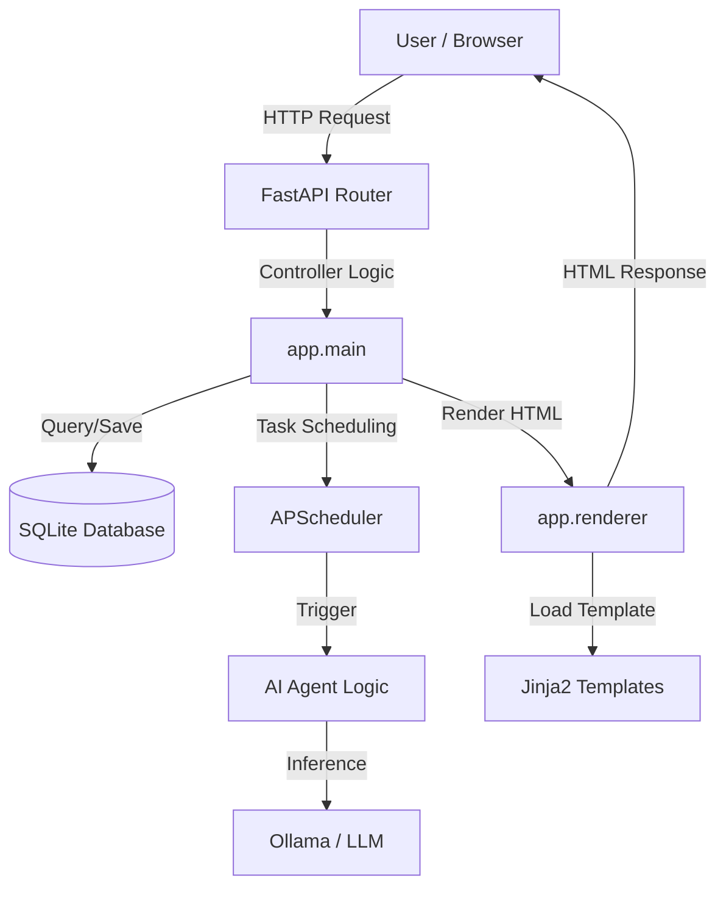

# Architecture Overview

## High-Level Structure

The Prompt Warzone application is structured as a modular FastAPI application using SQLModel for data persistence and Jinja2 for server-side rendering.

## Key Modules

### `app/`

- **`main.py`**: The entry point of the application. Handles routing, startup/shutdown events, and core logic.
- **`models.py`**: Defines the data models (schema) using SQLModel. Includes `Post` and `BannedIP`.
- **`db.py`**: Handles database connection and session management.
- **`renderer.py`**: Abstraction layer for rendering HTML templates.
- **`ai/`**: Contains logic for AI interactions, persona management, and multi-agent simulation.
- **`jobs.py`**: Configures background tasks and scheduled jobs (e.g., AI auto-reply).

### `templates/`

Contains HTML templates used by Jinja2.

### `static/`

Contains static assets like CSS and JavaScript files.

## Data Flow

1. **Request**: User submits a post or views a thread.
2. **Processing**: `main.py` accepts the request, validates input, and interacts with the database.
3. **AI Trigger**: If configured (e.g., "AI Reply" checked), an async task is triggered or scheduled via `jobs.py`.
4. **Inference**: The AI module constructs a prompt based on thread context and queries the LLM (Ollama).
5. **Persistence**: The AI response is saved to the database as a new `Post`.
6. **Response**: The updated thread is rendered and returned to the user.
